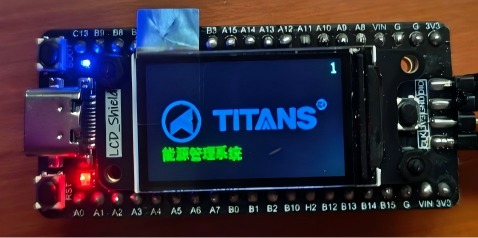
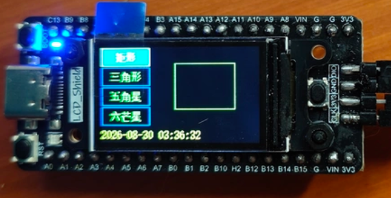
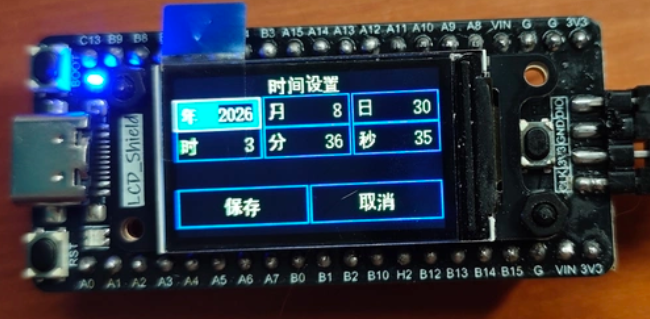

# HC32F460 嵌入式 GUI 终端

> 一块 HC32F460 驱动的 240×135 彩色 LCD 小设备：上电有开机动画，主页能切换图形、看实时钟；长按单键进设置页改时间，掉电不丢；串口可下命令对时。

配套文档：
- **需求设计文档**：[`docs/需求设计文档.md`](docs/需求设计文档.md)（功能需求汇总 + 从裸机 LED 到带屏设备的演进式开发设计）
- **环境搭建（GCC）**：工具链安装、`make` 构建避坑、VSCode 图形化调试，单开一篇：[`docs/HC32F460-笔记篇/笔记一-GCC工具链与环境搭建.md`](docs/HC32F460-笔记篇/笔记一-GCC工具链与环境搭建.md)（Keil 环境见 §5.1）

## 关于本系列：作者序与学习路线

这个项目不只是一份能跑的源码，更是一套**嵌入式 GUI 终端开发底座**的教学载体。

我把主线选在 HC32F460 这颗国产 Cortex-M4F 芯片上：200MHz、带 FPU、外设齐全，又足够"真实"——GPIO、时钟树、中断、DMA、Flash 掉电保存，以及最关键的"如何在资源受限的 MCU 上把 FreeRTOS 和 GUI 同时跑稳"，这些嵌入式工程师绕不开的硬骨头，你都会在这块板上亲手碰到、亲手解决。

整条学习路线分三步，对应仓库里的三篇文档，由浅入深、环环相扣：

| 阶段 | 文档 | 目标 |
|---|---|---|
| ① 裸机地基 | [`docs/HC32F460零基础实战DDL/`](docs/HC32F460零基础实战DDL/) | 用官方 DDL 库把 GPIO / USART / 定时器 / SPI / ADC / 中断一栋栋盖起来——学会看数据手册、会配外设，而不是被 HAL 包一层后变成"调 API 的搬运工" |
| ② RTOS 内核 | [`docs/HC32F460-freeRTOS实战/`](docs/HC32F460-freeRTOS实战/) | 把**较新版本的 FreeRTOS V10.4.6** 移植到 HC32F460，讲清任务划分、调度、IPC（信号量 / 队列 / 事件组）、中断与 RTOS 边界、内存管理，把"裸机轮询"升级为"多任务并发"，并自然引出本项目的工程骨架 |
| ③ GUI 外壳 | [`docs/HC32F460-guislice实战/`](docs/HC32F460-guislice实战/) | 把开源 GUIslice 适配到 HC32F460 + ST7789 彩屏，讲清驱动适配层、界面状态机、与主循环融合、中文字库生成，最终落到本项目这个开机动画 + 主页 + 设置页 + 串口 CLI 的完整终端 |

**作者的初衷**：很多嵌入式教程要么停在"点灯"，要么一上来就堆满 RTOS / GUI 概念让人望而却步。我特意用**同一块板、同一个递进项目**，让你从裸机一路走到"带 GUI 和 CLI 的成品终端"——过程中的每个概念，都有可编译、可调试、可观察的真实代码垫着，而不是飘在空中的概念。

**期望达到的效果**：学完这套，你收获的不只是"会用 HC32F460"，而是一套**相对标准的嵌入式 GUI 终端开发方法**——串口控制台负责交互与联调、GUI 负责人机界面、FreeRTOS 负责任务编排。这套范式可以平移到 STM32、GD32 等任意 Cortex-M 平台，因为底层思想（分层、适配层、RTOS 边界、资源脚本生成）是相通的。

三篇之外，`docs/HC32F460-笔记篇/` 收录了 GCC 工具链搭建、Console 组件与分层日志等"踩坑笔记"，可随时查阅。

---

## 开发板（本系列书籍指定硬件）

> 本系列**所有例程、截图、引脚定义、LED / 按键描述，都基于下面这块板**。读者若还没有合适的硬件，可自行购买——板上本身不带调试器，需在下单时**勾选 DAPLink 仿真器 + 1.14 寸彩屏**一起购买（如页面有配套选项），开箱即可与本仓库代码严格对应。

- **HC32F460 开发板（1.14 英寸 ST7789 彩色 LCD，调试器需另行选购）**
- 购买链接：<https://item.taobao.com/item.htm?id=693801792793>

说明：
- 板上**没有板载 DAPLink**；下单时请选择 **DAPLink 仿真器 + 1.14 寸彩屏**组合（如需调试器的话）。**1.14 寸彩屏**正好对应本项目 240×135 的显示需求。
- 仓库代码与该板硬件严格对应，文档中所有引脚、按键、LED 均以它为基准。
- 如果你使用其它 HC32F460 评估板（例如官方 `EV_HC32F460_LQFP100` 系列），其 BSP 引脚与本项目不同，详见本 README §3 / §8 与 DDL 篇关于 v1 / v2 BSP 的说明。

---

## 1. 项目简介

| 项 | 内容 |
|---|---|
| 主控 | 华大 HC32F460（ARM Cortex-M4F，200MHz） |
| 显示屏 | 240×135 横屏，ST7789 类，**SPI3 + DMA**，无触摸 |
| 实时系统 | FreeRTOS V10.4.6 |
| GUI 框架 | GUIslice（适配层 `gslc_drv_hc32`） |
| 实时钟 | 硬件 RTC + 32.768kHz 外部晶振 |
| 持久化 | Code Flash 末尾 8KB（日志式磨损均衡） |
| 输入 | 仅 PC13 单键（短按 / 长按复用） |
| 输出 | PA00 心跳 LED + USB 串口 CLI |
| 构建环境 | **Keil MDK（ARM Compiler 6 / AC6）** 与 **GNU Arm Embedded（GCC）** 两种均提供并验证可用，供读者按需选择学习（Keil 见 §5.1，GCC 见 §5.2 与笔记一） |

## 2. 它能做什么（功能特性）

| 特性 | 说明 |
|---|---|
| 启动页 | 上电显示 Logo 图片 + 右上角 5 秒倒计时，结束进主页 |
| 主页 | 左侧 4 种图形（矩形 / 三角 / 五角星 / 六芒星）循环选择；右侧实时绘制；底部状态栏显示墙钟 `YYYY-MM-DD HH:MM:SS` |
| 设置页 | 长按单键进入；6 字段（年/月/日/时/分/秒），长按切焦点、短按 +1，可保存 / 取消 |
| 实时钟 | 硬件 RTC 1 秒中断走时，零软件漂移，掉电可续 |
| 掉电保存 | 开机恢复、整分自动保存、串口 `settime` 立即保存 |
| 串口 CLI | `help`（框架内置）/ `clear` / `led on\|off\|blink` / `echo <text>` / `gettime` / `uptime` / `settime YYYY-MM-DD hh:mm:ss` |
| LED | **三色 LED（PA00/PA01/PA02，低电平点亮）** 心跳指示，可由 `led` 命令切换（blink = 三灯轮流闪） |
| 中文 | 以脚本生成点阵手绘，C 源码不含中文 |

对应需求见 `docs/需求设计文档.md` 第 2 章（FR-S01~09 系统级、FR-01~10 界面级）。

## 2.1 界面效果预览

| 界面 | 截图 |
|---|---|
| **启动页**（FR-01）：上电 Logo + 右上角 5 秒倒计时 |  |
| **主页 · 图形绘制**（FR-02/03/04）：左侧选图形、右侧实时绘制、底部墙钟 |  |
| **设置页 · 时间设置**（FR-05/06）：长按进页，6 字段短按/长按编辑 |  |

## 3. 硬件清单

- HC32F460 开发板（200MHz，XTAL 8MHz → MPLL）
- 240×135 SPI LCD（ST7789 类）
- PC13 按键（上拉，按下低）
- PA00/PA01/PA02 三色 LED（低电平点亮）
- 32.768kHz 外部晶振（RTC 用）
- USB 转串口（CLI）
- J-Link / DAPLink / PyOCD 调试器

## 4. 工程结构

```
.
├── driver/                 # HC32F46x 设备驱动库（inc/ src/）
├── mcu/                    # MCU 配置：CMSIS、启动文件、链接脚本
│   ├── common/             # system_hc32f46x.c 等
│   └── GCC/                # GCC 版 CMSIS
├── project/                # 应用与构建
│   ├── source/             # 用户源：main.c, app_time.c, nv_store.c, console.c,
│   │   ├── guislice/       #   gui.c, gslc_drv_hc32.c, gslc_config_hc32.h, titans_logo.h
│   │   └── bsp_key.c bsp_led.c tftlcd.c chinese_font*.c ...
│   ├── FreeRTOS/           # FreeRTOS 内核（portable 含 GCC/MDK/RVDS 的 ARM_CM4F）
│   ├── User/               # RTOSThread.c（任务创建入口）
│   ├── tools/              # 中文点阵 / 图片取模生成脚本（见第 7 节）
│   ├── GCC/                # GCC 构建（Makefile + 链接脚本 + 启动文件）
│   └── MDK/                # Keil MDK 工程（主工程，AC6，仅 1 个 Target）
├── GUIslice-master/        # GUIslice 开源 GUI 库（src/ 含 GUIslice.c + elem/）
├── usb_lib/                # USB 库
└── docs/                   # 需求设计文档.md + 三篇实战 + 笔记篇
```

## 5. 构建

Keil 工程开箱即用（§5.1）；GCC 的完整环境搭建（工具链安装、`make` 构建避坑、VSCode 图形化调试）单开一篇：[`docs/HC32F460-笔记篇/笔记一-GCC工具链与环境搭建.md`](docs/HC32F460-笔记篇/笔记一-GCC工具链与环境搭建.md)。两种环境均产出等价固件。

### 5.1 Keil MDK（主工程）

1. 安装 Keil MDK 与 ARM Compiler 6；
2. 打开 `project/MDK/HC32F460Template.uvprojx`；
3. 编译（Rebuild）→ 下载（Download）→ 运行。

> 主工程与编译器以 MDK AC6 为验证基准。新增 `.c` 需同步加入 `.uvprojx`。

### 5.2 GCC（开源工具链，Windows 下已验证可用）

`project/GCC/` 已提供完整适配的 Makefile + 链接脚本 + 启动文件，可在 GNU Arm Embedded Toolchain 下直接构建出与 Keil 工程等价的固件。

#### 5.2.1 需要安装的环境

| 工具 | 作用 | 验证版本 |
|---|---|---|
| `arm-none-eabi-gcc`（GNU Arm Embedded Toolchain） | C/C++ 编译、汇编、链接 | 10.3.1 |
| `make`（GNU Make） | 驱动 Makefile 构建 | 4.4.1 |
| （可选）`arm-none-eabi-gdb` / 烧录器驱动 | 调试 / 烧录，见第 6 节 | — |

#### 5.2.2 下载与安装

**方式 A：Chocolatey（Windows 推荐，一条命令自动配好 PATH）**
```powershell
# 管理员 PowerShell 执行
choco install gcc-arm-embedded make -y
```
装完新开一个终端，`arm-none-eabi-gcc --version` 与 `make --version` 应能直接运行。

**方式 B：winget（仅 ARM GCC，make 需另装）**
```powershell
winget install ArmGCC.Embedded
# make 可用 Chocolatey 一并安装：choco install make -y
# 或装 GnuWin32 make：https://gnuwin32.sourceforge.net/packages/make.htm
```

**方式 C：手动下载官方安装包（无包管理器时）**
- ARM GNU Toolchain（选 *AArch32 bare-metal target (`arm-none-eabi`)*）：
  https://developer.arm.com/downloads/-/arm-gnu-toolchain-downloads
- GNU Make for Windows：
  - xPack Windows Build Tools：https://github.com/xpack-dev-tools/windows-build-tools/releases
  - 或 GnuWin32 make：http://gnuwin32.sourceforge.net/packages/make.htm

手动安装后需把各自的 `bin` 目录加入系统 `PATH`（如 `C:\Program Files (x86)\Arm GNU Toolchain\...\bin`、`...\GnuWin32\bin`），否则命令行找不到。

#### 5.2.3 构建

```bash
cd project/GCC
make clean
make
```
产物：`build/hc32f460_lcd.elf`、`.hex`、`.bin`。

#### 5.2.4 配置要点（已固化在 Makefile，了解即可）

- **浮点**：HC32F460 是 Cortex-M4F（带 FPU），且 FreeRTOS 上下文切换（`port.c`）会保存 FPU 寄存器，因此必须启用 FPU：`-mfloat-abi=softfp -mfpu=fpv4-sp-d16`。早期“纯软浮点”写法会导致 `port.o` 汇编报 `selected FPU does not support instruction`，已修正。
- **链接脚本**：`hc32f46x_flash.ld` 的 `FLASH` 长度从 512K 缩到 **504K**，保留末尾 8KB（0x0007E000 起）给 `nv_store` 做掉电保存，避免代码排进持久化扇区。
- **GUIslice 配置**：`GUIslice.h` → `GUIslice_config.h`（库自带，已 `#include "gslc_config_hc32.h"`）→ 经 `-I project/source/guislice` 命中 hc32 定制配置，无需改 GUIslice 库。
- **跨平台 shell**：Makefile 按实际 shell 自动选择目录命令（Windows `cmd` 用 `if not exist` / `rmdir`，POSIX `sh` 用 `mkdir -p` / `rm -rf`），在原生 `cmd`、Git bash、Linux 下均可直接 `make`。

#### 5.2.5 验证状态

已在 **Windows + Chocolatey 工具链（gcc-arm-embedded 10.3.1 / make 4.4.1）** 下完整构建通过：
```
text=80612  data=0  bss=35612   （FLASH 占用 < 504K，未与 NVM 扇区冲突）
```
个别驱动源会有 `-Wstrict-aliasing`、`#warning Unknown device platform` 等告警，属正常、不影响产物；若报链接 `undefined reference`，检查 `Makefile` 的 `C_SOURCES` 是否含所需 `.c`。

## 6. 烧录与调试

所需硬件：HC32F460 开发板 + J-Link / DAPLink / PyOCD（SWD）。

```bash
# 方法 1：J-Link
JLinkExe -device HC32F460 -if SWD -speed 4000 -autoconnect 1

# 方法 2：PyOCD
pyocd flash -t hc32f460 build/hc32f460_lcd.hex

# 方法 3：OpenOCD
openocd -f interface/jlink.cfg -f target/hc32f460.cfg \
  -c "program build/hc32f460_lcd.elf verify reset exit"
```

串口 CLI 默认 115200 8N1，上电后可输 `help` 查看命令。

> 想要「F5 一键自动构建 + 烧写 + 拉起调试」的体验（VSCode + Cortex-Debug + external gdbserver），见 [`docs/HC32F460-笔记篇/笔记一-GCC工具链与环境搭建.md`](docs/HC32F460-笔记篇/笔记一-GCC工具链与环境搭建.md) 第 6.2.6 / 6.4 节。

## 7. 资源生成（中文 / 图片）

中文与图片一律由脚本生成字节数组，C 源码保持干净、跨编译器：

```bash
# 生成中文点阵（改词条后重跑）
python project/tools/gen_chinese_font.py
# 生成开机 Logo 图片取模
python project/tools/gen_image.py
```

生成物：`chinese_font_data.c` / `cn_strings.h` / `tftlcd` 相关图片头。**勿手改这些生成文件**。

## 8. 注意事项

1. 固件需烧录到 MCU Flash 执行；RTC 依赖外部 32.768kHz 晶振，未焊/不起振则墙钟不走（界面静止默认时间）。
2. `nv_store` 用 Flash 末尾 8KB，链接脚本已保留，请勿把代码排进该区。
3. 时间权威归硬件 RTC，界面只读取展示；改时间走 `AppTime_Set()`，落盘走 `nv_store` 队列。
4. 中文走手绘点阵，GUI 框架自带字体仅 ASCII；如需框架内中文，需生成 GUIslice 中文字体。
5. 提供 **Keil MDK（AC6）** 与 **GCC** 两种构建环境，均验证可用：Keil 见 §5.1，GCC 见 §5.2 与 [`docs/HC32F460-笔记篇/笔记一-GCC工具链与环境搭建.md`](docs/HC32F460-笔记篇/笔记一-GCC工具链与环境搭建.md)。

## 9. 参考文档

- [`docs/需求设计文档.md`](docs/需求设计文档.md) — 功能需求汇总、潜在优化点、从裸机 LED 到带屏设备的演进式开发设计（**需求设计总入口**）
- [`docs/HC32F460-笔记篇/README.md`](docs/HC32F460-笔记篇/README.md) — 笔记篇索引
  - [笔记一 · GCC 工具链与环境搭建](docs/HC32F460-笔记篇/笔记一-GCC工具链与环境搭建.md) — **环境搭建**：工具链安装、`make` 构建、FPU/Flash 避坑、VSCode 图形化编译与调试
  - [笔记二 · 控制台组件 Console 与分层日志](docs/HC32F460-笔记篇/笔记二-控制台组件Console与分层日志.md) — Console 组件与分层日志设计
- HC32F46x 数据手册 / 用户手册
- 正点原子《FreeRTOS开发指南》——FreeRTOS 学习参考资料（仓库不附带原书文件）
- FreeRTOS 官方文档
- GUIslice 官方 Wiki

## 10. 许可证 / License

- **本仓库中由 mark0402 编写 / 整理的代码与文档**采用 **MIT 开源协议**：`README.md`、`docs/` 全部文档、`project/User/`、`project/source/`（含 `guislice/` 适配层）、`project/tools/` 脚本，以及 `project/GCC/`、`project/MDK/`、`project/EWARM/` 下的工程与构建文件。任何人（**含商业用途**）均可免费使用、修改、分发，仅需保留版权与许可声明。详见根目录 [`LICENSE`](LICENSE) 文件与各源文件头部的 `SPDX-License-Identifier: MIT`。
- **第三方组件保留其原始开源协议，不在本仓库 MIT 授权范围内**，使用时请遵守各自协议：
  - 小华半导体（HDSC）HC32F460 DDL / SDK：`driver/`、`mcu/`、`hc32f460_ddl_Rev2.2.0/`、`HC32F460 Demo/` —— 华大原厂许可；
  - FreeRTOS：`project/FreeRTOS/` —— FreeRTOS 官方 MIT 类许可（含于各源文件头）；
  - GUIslice：`GUIslice-master/` —— GUIslice 原许可；
  - USB 库：`usb_lib/` —— 原厂 / 库许可；
  - 中间件：`midware/`（FatFs、w25qxx、wm8731、sd_card 等）—— 各自原许可；
  - LwBTN（轻量按键库，含 `lwbtn.c/.h`、`lwbtn_opt.h`、`lwbtn_opts.h`，位于 `project/source/lwbtn/`）：Tilen MAJERLE 原许可（MIT）。
